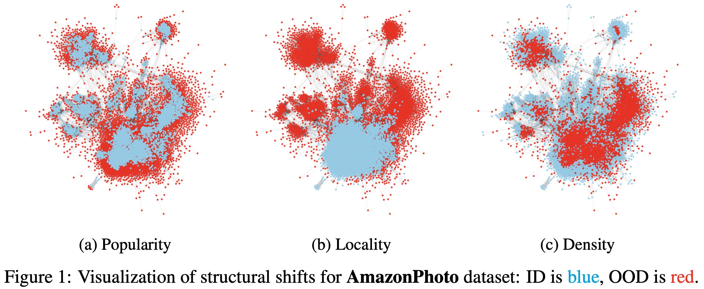

# Evaluating Robustness and Uncertainty of Graph Models Under Structural Distributional Shifts

This repository provides an official implementation of experimental framework for the paper [Evaluating Robustness and Uncertainty of Graph Models Under Structural Distributional Shifts](https://arxiv.org/abs/2302.13875)

## Overview

To evaluate the performance of graph models, it is important to test them on diverse and meaningful distributional shifts. However, most graph benchmarks that consider distributional shifts for node-level problems focus mainly on node features, while data in graph problems is primarily defined by its structural properties. In this work, we propose a general approach for inducing diverse distributional shifts based on graph structure.



## Implementation of Structural Shifts in Graph ML Frameworks

Our approach to create data splits with structural distributional shifts can be accessed in DGL via [`dgl.data.add_node_property_split`](https://docs.dgl.ai/generated/dgl.data.utils.add_node_property_split.html) and in PyG via [`torch_geometric.transforms.NodePropertySplit`](https://pytorch-geometric.readthedocs.io/en/latest/generated/torch_geometric.transforms.NodePropertySplit.html).

## Installation

This code requires the packages listed in `environment.yaml`. You can create a separate conda environment with these dependecies by running the following command in the root directory of this project:
```
conda env create -f environment.yaml
```

Just in case, you can also use `instruction.txt` — a list of conda commands that were run to create the same environment and install the necessary packages.

## Running Experiments

If you are in the root directory of this project, you can run an experiment on `<dataset_name>` graph dataset with `<strategy_name>` split strategy for `<version_name>` version of `<method_name>` method using the following command:
```
python main.py --run_config_path ./configs/run_configs/<dataset_name>/<strategy_name>/<method_name>/<version_name>/run_config.yaml
```

For instance, if you want to run an experiment with the **standard** version of **GPN** (Graph Posterior Network) on **AmazonComputer** dataset with **popularity** data split, try this one:
```
python main.py --run_config_path ./configs/run_configs/amazon-computer/popularity/gpn/standard/run_config.yaml
```

Other possible values for `<dataset_name>` and `<method_name>` can be found by the names of config files in the corresponding `configs` subdirectories — `configs/dataset_configs/` and `configs/method_configs/`.

## Repository Structure

This repository is organised as follows:

### `configs`

Here you can see various subdirectories containing structured `.yaml` files with experiment configurations:
- `datamodule_condigs`: configurations for `pl.LightningDataModule` that are used by `pl.Trainer` managers
- `dataset_configs`: description of datasets, including basic dataset properties and exploited split strategies
- `experiment_configs`: regulations for `pl.Trainer` managers on how to perform training and inference
- `method_configs`: parameters of `pl.LightningModule` that describe how `pl.Trainer` managers should use the underlying models
- `run_configs`: intermediate configurations that store paths to other config files and target directory for saving experiments
- `trainer_configs`: parameters for `pl.Trainer` managers that directly perform training and inference

### `datasets`

This subdirectory contains all the proposed datasets and corresponding data splits. For more technical information, please refer to the `README.md` file inside the `datasets` subdirectory.

### `source`

Here you can find the source code of our experimental framework:
- `data`: everything related to data processing and loading
- `experiment`: some classes that are used to setup necessary dependecies and run experiments
- `layers`: implementation of considered model architectures
- `metrics`: various routine for computing metrics
- `modules`: classes that describe how particular models are used by managers at some specific training or evaluation stage
- `utils`: general utils that do not belong to `source.data`, `source.layers` or `source.modules`, but support execution of experiments (sync configs, save results, etc.)

### `main.py`

This main script for loading experimental configs and performing training or evaluation.

If you want to change the parameters of your experiment, whether it is the data split strategy, the hidden dimension of the model layer, the index of GPU at your server, or something else, please check the corresponding `configs` subdirectory. 
Also, if you need to access the proposed graph datasets or associated data splits, please refer to the `dataset` subdirectories. 
Finally, if you are interested in the source code for our experimental pipeline, including models, methods and metrics, you should take a look at the `source` subdirectories.
